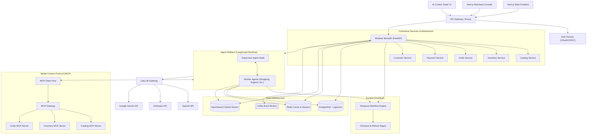
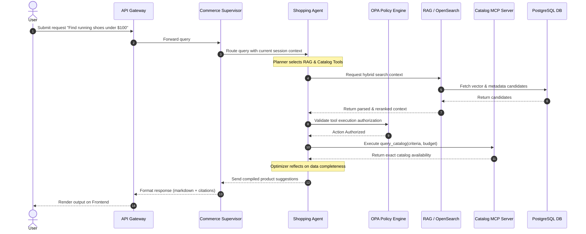
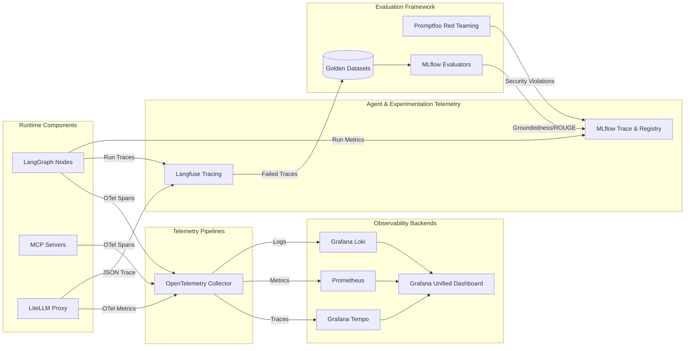
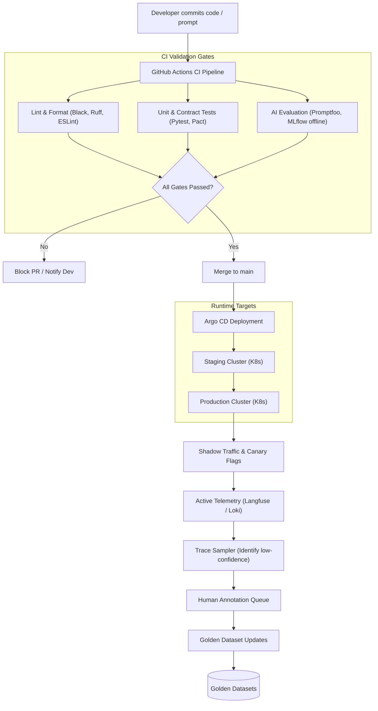

# Agentic Commerce Platform

Agentic Commerce Platform is an industry-standard, production-grade Agentic AI commerce platform implemented at portfolio scale. 

This project demonstrates the complete production lifecycle of modern Agentic AI systems, from foundational e-commerce domain services through LLM application engineering, durable orchestrations, security policy enforcement, vendor-neutral OpenTelemetry tracing, and quantitative evaluation suites.

---

## Executive Summary

Agentic Commerce Platform represents a transition from typical AI prototypes to a hardened, enterprise-ready agent platform. It implements a realistic e-commerce backend integrated with a stateful multi-agent workforce. The agents run on [LangGraph](https://github.com/langchain-ai/langgraph) for complex reasoning and coordinate with [Temporal](https://temporal.io/) to enforce durability and consistency for transactional business logic. 

Rather than relying on model judgment to secure actions, the system enforces access control via [Open Policy Agent (OPA)](https://www.openpolicyagent.org/) and deterministic schema validation. The platform is instrumented end-to-end with **OpenTelemetry**, exporting metrics, logs, and traces to **Langfuse**, **MLflow**, and standard observability backends (Prometheus, Tempo, Loki, Grafana). 

The repository functions as a modular monorepo, evolving systematically through 28 structured engineering stages, each governed by strict exit criteria and automated quality gates.

---

## Why This Project Exists

Most Agentic AI resources focus on low-complexity chat interfaces, mock functions, and unconstrained agency. While easy to build, these systems fail in production due to:
* **State Drift & Fragility**: Unstructured chat threads cannot maintain state over long-running business processes.
* **Lack of Guardrails**: Relying on models to respect authorization boundaries leads to privilege escalation.
* **Zero Observability**: Tracking multi-agent loops, tool execution latency, and token cost is impossible without structured telemetry.
* **Absent Evaluation**: Prompts and architectures are updated without regression testing, breaking downstream agents.
* **Fragile Integrations**: Direct coupling of tools to agent runtimes prevents reuse and standard interoperability.

Agentic Commerce Platform addresses these vulnerabilities by establishing a reference architecture that treats agent development as a software engineering discipline.

---

## Key Differentiators

* **Modular Monolith First**: The application starts as a modular monolith to avoid premature microservices overhead, using strict namespace boundaries that allow clean service extraction when justified.
* **Deterministic Policy Gates**: High-risk actions (e.g., payment captures, refunds, inventory overrides) are governed by Open Policy Agent (OPA) policies written in Rego, preventing models from overriding authorization rules.
* **Durable Orchestration Split**: Transient agent decision-making is isolated within LangGraph, whereas transactional workflows (e.g., checkout fulfillment, payment reconciliation) are executed by Temporal workflows.
* **OpenTelemetry Core**: Instrumentation is built directly on vendor-neutral OpenTelemetry standards, avoiding lock-in to proprietary tracking SaaS products.
* **Continuous Evaluation**: Every PR triggers automated evaluations measuring RAG groundedness, tool routing accuracy, trajectory coherence, and security compliance.

---

## Project Scope

### Goals
* **Scale-Ready Reference**: Serve as a production-grade template for deploying multi-agent systems in transactional domains.
* **E2E Traceability**: Trace every request from the client UI down to individual LLM calls, MCP calls, database queries, and evaluations.
* **Comprehensive Test Coverage**: Combine traditional testing (unit, integration, load, contract) with AI evaluations (adversarial, RAG, tool, and operational metrics).
* **GitOps Alignment**: Manage infrastructure, configurations, OPA policies, prompts, and agent models entirely via Git repositories.

### Non-Goals
* **Replacing Core Databases**: The system does not replace standard transactional databases with LLM memory.
* **Model-Calculated Financials**: Pricing, taxes, and cart calculations are handled by deterministic e-commerce code, not LLM reasoning.
* **Custom Framework Creation**: The project does not build custom graph orchestrators. It leverages LangGraph and extends it.

---

## Core Engineering Principles

1. **Production capability over framework accumulation**: Prefer a minimal, well-integrated set of production tools over an unnecessary collection of competing libraries.
2. **Open standards over vendor lock-in**: Leverage OpenTelemetry, PostgreSQL, and Model Context Protocol (MCP) to maintain cloud and gateway portability.
3. **Deterministic systems for deterministic business rules**: Use standard code and policies for business constraints; use agents only for reasoning and unstructured parsing.
4. **Agents only where reasoning/autonomy provides value**: Do not wrap standard CRUD operations in slow, expensive agent logic.
5. **Tool calls must be authorized and auditable**: Every tool invocation is authenticated, validated, and logged to an audit trace.
6. **Sensitive actions require policy enforcement and human approval**: Implement risk-based thresholds that pause workflows for manual review.
7. **Observability is not evaluation**: Telemetry tracks execution; evaluation assesses quality and compliance. Both are required.
8. **Evaluation is not operational evaluation**: Offline evaluations run on datasets; operational evaluations run against performance, cost, and reliability metrics.
9. **Operational evaluation is not simply monitoring**: Operational evaluation correlates system behavior directly with business outcome success (e.g., CSAT, conversion rate).
10. **Business success is part of agent quality**: An agent that answers correctly but drops the shopping cart checkout rate is a failed deployment.
11. **Production failures are expected and engineered for**: Build resilience against LLM provider outages, slow dependencies, and network partitions.
12. **Every AI component must be versioned**: Track prompt, retriever, embedding, model, policy, and tool versions in metadata.
13. **Production traces must feed regression datasets**: Mine low-confidence traces to continuously expand test suites.
14. **AI deployments require evaluation gates**: Implement automated test suites that prevent degraded agents from reaching staging or production.
15. **Modular boundaries**: Enforce strict domain isolation at the package level to ease future microservice extraction.
16. **Minimal microservices initially**: Start with a modular monolith to avoid operational complexity during early stages.
17. **No artificial complexity**: Avoid deploying infrastructure (e.g., Kubernetes, Kafka) until the development roadmap requires it.
18. **Policy-as-Code**: Isolate authorization logic from application code using structured OPA policies.
19. **Memory safety and isolation**: Enforce memory limits and partition state to protect data boundaries.
20. **Cost governance by design**: Enforce hard token and financial budgets at the routing gateway.

---

## Domain Architecture

The platform models a realistic e-commerce ecosystem consisting of:

```
┌──────────────────────────────────────────────────────────────────────────────────────────┐
│                                Agentic Commerce Platform                                 │
├───────────────┬─────────────────┬───────────────────┬───────────────┬────────────────────┤
│ Product       │ Inventory &     │ Customers & Carts │ Checkout &    │ Merchant Analytics │
│ Catalog & SKUs│ Warehousing     │ Profile & History │ Payments      │ & Pricing          │
└───────────────┴─────────────────┴───────────────────┴───────────────┴────────────────────┘
```

Agents operate against these services using standard REST APIs, event schemas, and standardized MCP servers.

---

## Agent Workforce

The workspace supports 12 specialized agents, organized hierarchically:

1. **Commerce Supervisor Agent**: Orchestrates multi-agent routing, coordinates user requests, manages shared context, and handles delegation.
2. **Shopping Agent**: Assists users with catalog discovery, product comparisons, recommendations, and shopping cart management.
3. **Order Agent**: Tracks order status, manages modifications, handles cancellations, and interfaces with fulfillment.
4. **Customer Support Agent**: Resolves general FAQs, processes initial complaints, and manages escalation paths.
5. **Returns & Refund Agent**: Inspects purchase history, validates refund rules, and triggers Temporal refund sagas.
6. **Inventory Agent**: Checks stock availability, monitors warehouse status, and provides restocking alerts.
7. **Pricing & Promotion Agent**: Evaluates active coupons, applies customer-specific discounts, and handles pricing audits.
8. **Catalog Agent**: Manages metadata enrichment, categorization, and updates to the product catalog database.
9. **Fulfillment Agent**: Tracks warehouse pick-and-pack status, coordinates logistics partners, and handles shipping notifications.
10. **Risk / Fraud Agent**: Analyzes transaction velocity, customer history, and payment details to flag high-risk transactions.
11. **Procurement Agent**: Generates purchase orders for low-stock SKUs and coordinates with supplier APIs.
12. **Merchant Analytics Agent**: Produces reports on sales volume, conversion rates, catalog performance, and customer satisfaction metrics.

---

## System Architectures

### 1. Platform Architecture


---

### 2. Agent/Tool/RAG Interaction


---

### 3. Observability & Evaluation Architecture


---

### 4. Development Lifecycle


---

## Detailed Lifecycles

### Request Lifecycle
1. **Ingress**: The user submits a natural language prompt via the Next.js UI.
2. **Gateway Processing**: The API Gateway validates JWT credentials, rate-limits the requester, and extracts tracking metadata (e.g., `traceparent`).
3. **Session Retrieval**: The router fetches user history and session state from Redis.
4. **Policy Pre-Check**: The request passes through OPA to verify that the active user roles permit access to the target workspace.
5. **Supervisor Routing**: The Commerce Supervisor determines if the query requires specialized agent handling or direct execution.
6. **Egress**: The generated markdown response is streamed to the user via Server-Sent Events (SSE).

### Agent Lifecycle
1. **Initialization**: LangGraph runtime instantiates the graph topology with the session state.
2. **Execution Loop**:
    * **Plan**: The agent determines a sequence of actions based on the current state.
    * **Verify**: The OPA engine validates the selected actions against context policy rules.
    * **Execute**: The agent runs the tools (database lookups, RAG, external APIs) sequentially or in parallel.
    * **Reflect**: The agent reviews the tool output to ensure it matches the request goals. If unsatisfactory, it rewrites the query and executes again.
3. **Checkpointing**: At each node transition, the current state is serialized and persisted to the Postgres checkpointer.
4. **Termination**: The agent returns the final result, updates long-term memory databases, and transitions back to idle state.

---

## Technical Architecture Components

### RAG Strategy
* **Ingress Pipeline**: Automatically parses PDF manuals, HTML documentation, and JSON catalogs. Standardizes text and tracks document versioning metadata.
* **Semantic Chunking**: Employs layout-aware separators combined with token-limit heuristics.
* **Hybrid Indexing**: Combines dense vector embeddings (using PGVector) with sparse BM25 indices (using OpenSearch) to capture semantic meaning and exact keyword matches.
* **Reranking**: Uses FlashRank/Cohere to score and truncate candidate contexts before generating prompts.
* **Agentic Control**: LangGraph routes queries to appropriate retrievers and executes self-correction loops if retrieved documents fail groundedness metrics.

### MCP (Model Context Protocol)
* **Agent-to-Tool Protocol**: Standardizes how LLM nodes discover and execute capabilities.
* **Separation of Concerns**: MCP clients are built into the agent runtimes, while catalog, inventory, and order systems expose independent MCP servers.
* **Access Control**: The MCP Gateway sits between agent engines and servers, translating JWT scopes to tool execution permissions.

### A2A (Agent-to-Agent)
* **Decentralized Negotiation**: Used where independent domains must interact without sharing databases.
* **Protocol Standard**: Employs lightweight JSON-RPC over WebSockets.
* **Agent Cards**: Self-documenting agent capabilities used by routers to dynamically discover route targets.

### Memory Systems
```
┌─────────────────────────────────────────────────────────────────────────────┐
│                            Agent Memory Engine                              │
├───────────────────────┬──────────────────────────┬──────────────────────────┤
│ Short-Term / Session  │ Episodic Memory          │ Semantic Memory          │
│ (Redis Key-Value)     │ (Postgres Checkpointer)  │ (Vector embeddings DB)   │
├───────────────────────┼──────────────────────────┼──────────────────────────┤
│ Fast read/write of    │ Complete node-by-node    │ Long-term profiles, user │
│ current thread state  │ historical trajectories  │ preferences, and insights│
└───────────────────────┴──────────────────────────┴──────────────────────────┘
```

---

## Observability Foundation

The project implements a vendor-neutral OpenTelemetry core pipeline:

```
                  ┌──────────────────────┐
                  │ Runtime Components   │
                  │ (FastAPI, Agents)    │
                  └──────────┬───────────┘
                             │ OTel Spans
                             ▼
                 ┌─────────────────────────┐
                 │ OpenTelemetry Collector │
                 └─────┬───────────┬───────┘
                       │           │           
             Traces    ▼           ▼  Metrics
      ┌──────────────────┐       ┌─────────────────┐
      │  Grafana Tempo   │       │   Prometheus    │
      └──────────────────┘       └─────────────────┘
```

* **Traces**: Capture the complete request chain across all agent handoffs, tools, database queries, and external APIs.
* **Metrics**: Record resource usage, execution latencies, token consumption, and cost per workflow session.
* **Logs**: Consolidated using Grafana Loki, maintaining trace context links for correlation search.
* **Vendor Agnostic**: Configured so developers can substitute backends (e.g., Datadog, Dynatrace) without altering core code.

---

## Evaluation Architecture

Evaluation runs continuously across both development and production lifecycles:

### Offline Evaluations
* **Golden Datasets**: A version-controlled corpus of target user queries, expected outputs, and acceptable tool invocations.
* **Automated Judges**: LLM-as-a-judge patterns scoring responses on groundedness, relevance, and policy adherence.
* **CI gates**: Block code merges if semantic alignment scores fall below threshold limits.

### Online Evaluations
* **Trace Sampling**: Automatically registers a configurable fraction of production traces into review queues.
* **Dynamic Quality Monitors**: Track confidence scores at runtime, flagging loops or incoherent agent steps for manual annotation.

### Security Evaluations
* **Red Teaming**: Uses Promptfoo to simulate prompt injection, system prompt leakage, and database injection attacks.
* **PII Detection**: Evaluates system behavior to ensure no credit card numbers or address details leak in responses.

---

## Operational Evaluation Architecture

Operational evaluation assesses the stability, cost, and efficiency of the agent platform:

| Evaluation Metric | Target Threshold | Monitoring Mechanism | Action on Violation |
|---|---|---|---|
| **Task Success Rate** | > 98% | Prometheus Counters | Alert Slack & On-Call Eng |
| **Workflow Completion** | > 95% | Temporal Workflow Logs | Auto-retry with compensation |
| **P95 Latency** | < 4.5s | OTel Span Metrics | Route to faster model tier |
| **Loop Count Limit** | Max 4 iterations | LangGraph State Guard | Terminate, escalate to human |
| **Cost per Checkout** | < $0.05 | LiteLLM Billing Logs | Restrict token usage budget |

---

## Governance & Security Architecture

* **Deterministic Policies**: No agent can execute an order update without passing rules written in Open Policy Agent (OPA).
* **Role-Based Access Control (RBAC)**: Users are classified (e.g., Customer, Merchant Admin, Support Agent) and mapped to appropriate tool execution scopes.
* **Data Isolation**: Multi-tenant database schemas ensure customers can never search catalogs, histories, or memories belonging to other accounts.
* **Secrets Management**: Credentials (LLM API keys, database links) are stored in AWS Secrets Manager or HashiCorp Vault, mounted as short-lived environment secrets.

---

## Technology Stack

### Languages & Frameworks
* **Languages**: Python (3.11+), TypeScript (5+)
* **Frontend**: Next.js (App Router), React, Tailwind CSS
* **Backend**: FastAPI, Pydantic (v2), AsyncIO

### Database & Vector Infra
* **Primary DB**: PostgreSQL (Relational transactions)
* **Vector Index**: PGVector (Dense embedding matches)
* **Search Engine**: OpenSearch (Sparse hybrid queries & metadata filtering)
* **Cache / Session**: Redis / Valkey

### AI & Agent Tooling
* **Orchestrator**: LangGraph (Stateful workflow graphs)
* **Model Gateway**: LiteLLM Proxy (Routing, fallbacks, cost limits)
* **Interop Layer**: Model Context Protocol (MCP)

### Durable Orchestration
* **Workflow Engine**: Temporal

### Observability & Evals
* **Collector**: OpenTelemetry Collector
* **Metrics/Traces**: Prometheus, Grafana, Tempo, Loki
* **Agent Traces**: Langfuse
* **Evaluation Tracker**: MLflow
* **Security Red Teaming**: Promptfoo

---

## Production Tooling Choices vs. Alternatives

| Component | Production Choice | Lab / Evaluation Comparison | Architectural Tradeoff / Rationale |
|---|---|---|---|
| **Orchestration** | **LangGraph** | OpenAI Agents SDK, CrewAI | LangGraph provides low-level control over state variables, node transitions, and checkpointers, which is essential for deterministic debugging. |
| **Vector Search** | **PostgreSQL + pgvector** | Pinecone, Qdrant | Keeps transaction data and semantic indices inside the same ACID-compliant database, reducing replication lag. |
| **Search Engine** | **OpenSearch** | Elasticsearch, Weaviate | OpenSearch offers native hybrid search filters and BM25 implementations while maintaining open licensing. |
| **Durable Workflows** | **Temporal** | LangGraph checkpointers | LangGraph checkpointing handles agent step recovery; Temporal ensures robust database updates and sagas. |
| **LLM Gateway** | **LiteLLM Proxy** | Direct SDK calls | Centrally manages token budgets, model fallback routing, and credentials across different cloud networks. |
| **Telemetry** | **OpenTelemetry** | Proprietary SaaS | Prevents vendor lock-in by routing application events through a standard pipeline. |

---

## Repository Structure

The project is organized as a unified monorepo to ensure clean local development and consistent versioning:

```
agentic-commerce-platform/
│
├── apps/
│   ├── web/                    # Next.js customer frontend
│   ├── merchant-console/       # Next.js admin interface
│   ├── control-tower/          # Next.js system diagnostics interface
│   └── api/                    # FastAPI main entrance
│
├── services/                   # Modular Monolith core domains
│   ├── catalog/                # Catalog models and logic
│   ├── inventory/              # Inventory and warehouse logic
│   ├── orders/                 # Cart and checkout processes
│   ├── payments/               # Payment gateways
│   ├── shipping/               # Logistics integrations
│   └── customers/              # User profiles and authentication
│
├── agents/                     # LangGraph definitions
│   ├── supervisor/             # Router and coordinator graph
│   ├── shopping/               # Product discovery agent
│   ├── orders/                 # Order modifications agent
│   ├── support/                # Customer service agent
│   ├── inventory/              # Supplier ordering agent
│   └── shared/                 # Common prompt templates and tools
│
├── mcp/                        # Model Context Protocol
│   ├── servers/                # Domain-specific MCP servers
│   ├── clients/                # Agent runtime hosts
│   └── gateway/                # Routing proxy and auth layer
│
├── rag/                        # Retrieval Augmented Generation
│   ├── ingestion/              # PDF/HTML ingestion scripts
│   ├── retrieval/              # OpenSearch queries & dense search
│   ├── reranking/              # Cohere/FlashRank models
│   └── evaluation/             # Groundedness tests
│
├── memory/                     # Semantic and episodic memory store
│
├── workflows/
│   └── temporal/               # Transactional checkout and refund sagas
│
├── evaluation/
│   ├── datasets/               # golden-scenarios.json
│   ├── offline/                # Offline testing scripts
│   ├── online/                 # Online telemetry scoring
│   ├── operational/            # SLA & Cost calculation logic
│   ├── security/               # Promptfoo red teaming setup
│   └── scorers/                # Custom evaluator algorithms
│
├── observability/
│   ├── otel/                   # OpenTelemetry collector configuration
│   ├── langfuse/               # Self-hosted settings
│   ├── mlflow/                 # MLflow server tracking config
│   ├── prometheus/             # Prometheus scrape target metrics
│   └── grafana/                # Production dashboards
│
├── platform/
│   ├── gateway/                # Reverse proxy settings
│   ├── policy/                 # Open Policy Agent Rego files
│   ├── auth/                   # JWT validation and scopes
│   └── feature-flags/          # Flagsmith configuration
│
├── events/                     # Kafka schemas and registry definitions
│
├── infrastructure/
│   ├── docker/                 # Local deployment Dockerfiles
│   ├── kubernetes/             # Production manifests
│   ├── helm/                   # Service charts
│   ├── terraform/              # AWS resources (EKS, RDS, MSK)
│   └── argocd/                 # GitOps application definitions
│
├── tests/                      # System-wide test suite
│
├── docs/                       # Project documentation
│   ├── architecture/           # Deep-dives
│   ├── adr/                    # Architecture Decision Records
│   ├── runbooks/               # On-call mitigation steps
│   ├── threat-model/           # Vulnerability maps
│   └── diagrams/               # Generated architecture assets
│
├── scripts/                    # Seed scripts, setups, helpers
│
├── .github/
│   └── workflows/              # GitHub Actions pipelines
│
├── README.md                   # Project charter & roadmap
└── package.json
```

---

## Development Program (Roadmap)

```
                       Stage 00: Engineering Foundation (IN PROGRESS)
                                         │
                                         ▼
                             Stage 01: Commerce Core
                                         │
                                         ▼
                       Stage 02: LLM Application Foundation
                                         │
                                         ▼
                            Stages 03-08: RAG & Agents
                                         │
                                         ▼
                       Stages 09-14: MCP, Multi-Agent & Sec
                                         │
                                         ▼
                       Stages 15-20: OTel, Evals & Resilience
                                         │
                                         ▼
                        Stages 21-28: Event, Ops & Cloud
```

---

### Stage 00 — Engineering Foundation
* **Status**: `In Progress`
* **Objective**: Initialize the monorepo structure, lock Python/TypeScript environments, and configure local container runtimes.
* **Key Technologies**: Python, TypeScript, Docker Compose, Black, Ruff, ESLint, Prettier, Pytest, GitHub Actions.
* **Exit Criteria**:
    * Monorepo skeleton directory tree initialized.
    * Containerized development environment runs successfully via `docker-compose up`.
    * Pre-commit hooks pass locally with zero warnings.
    * CI pipeline baseline established, passing boilerplate checks.

### Stage 01 — Commerce Core
* **Status**: `Planned`
* **Objective**: Build the core transactional e-commerce APIs without any AI components.
* **Key Technologies**: FastAPI, PostgreSQL, SQLAlchemy, Alembic, Pydantic, Redis.
* **Exit Criteria**:
    * Databases seeded with realistic catalogs, inventories, and user profiles.
    * REST endpoints operational for products, cart operations, order submissions, and returns.
    * Integrations validated with >85% unit test coverage.

### Stage 02 — LLM Application Foundation
* **Status**: `Planned`
* **Objective**: Establish secure model connectivity, routing strategies, and schema mappings.
* **Key Technologies**: LiteLLM Proxy, OpenAI, Anthropic, Gemini, Pydantic validation.
* **Exit Criteria**:
    * LiteLLM proxy routes queries with structured JSON responses.
    * Fallback and retry configurations verified.
    * API usage cost and token metrics tracked.

### Stage 03 — Tool Calling Foundation
* **Status**: `Planned`
* **Objective**: Create tool execution frameworks for e-commerce services with strict schemas.
* **Key Technologies**: Pydantic XML/JSON schemas, function calling interfaces.
* **Exit Criteria**:
    * Shopping Assistant resolves product queries by calling database tools.
    * Parallel execution of catalog tools verified.
    * Invalid arguments or execution failures handled gracefully.

### Stage 04 — Knowledge & Retrieval Foundation
* **Status**: `Planned`
* **Objective**: Deploy a foundational RAG pipeline for customer FAQs and policies.
* **Key Technologies**: pgvector, SentenceTransformers, LangChain splitters.
* **Exit Criteria**:
    * Documents chunked, indexed, and query responses returned with citations.
    * Retrieval precision scores >0.8 on baseline queries.

### Stage 05 — Advanced Retrieval
* **Status**: `Planned`
* **Objective**: Improve search relevance by combining text search with vector algorithms.
* **Key Technologies**: OpenSearch, BM25, Cohere Rerank, FlashRank.
* **Exit Criteria**:
    * Hybrid index operations verified.
    * MRR and nDCG metrics show statistical improvements over vector-only indices.

### Stage 06 — Agentic RAG
* **Status**: `Planned`
* **Objective**: Move search decisions and evaluation loops into stateful agent graphs.
* **Key Technologies**: LangGraph, grading nodes, query rewrite templates.
* **Exit Criteria**:
    * Flow routes to web search or fallback if context documents fail quality checks.
    * Agent recovers from incomplete search outputs.

### Stage 07 — Single-Agent Runtime
* **Status**: `Planned`
* **Objective**: Build a stateful Shopping Agent capable of multi-step reasoning.
* **Key Technologies**: LangGraph, checkpointers, state channels.
* **Exit Criteria**:
    * Thread history persisted to database checkpoints.
    * Interrupted execution loops resume without state loss.

### Stage 08 — Memory & Context Engineering
* **Status**: `Planned`
* **Objective**: Support user-specific preference history and context window limits.
* **Key Technologies**: Redis, semantic vector stores, token budgeters.
* **Exit Criteria**:
    * Customer preferences remembered across separate sessions.
    * Prompts dynamically trimmed when history exceeds token budgets.

### Stage 09 — MCP Tool Platform
* **Status**: `Planned`
* **Objective**: Transition direct tool integrations to standardized Model Context Protocol servers.
* **Key Technologies**: MCP SDK, MCP Client, MCP Gateway.
* **Exit Criteria**:
    * Catalog, inventory, and order systems expose valid MCP interfaces.
    * MCP Gateway authenticates requests before routing.

### Stage 10 — Multi-Agent Commerce
* **Status**: `Planned`
* **Objective**: Orchestrate multiple specialized agents controlled by a coordinator.
* **Key Technologies**: LangGraph Hierarchical Graphs, Agent-as-Tool abstractions.
* **Exit Criteria**:
    * Supervisor routes customer requests to target agents.
    * State variables passed between agents without loss or loop deadlocks.

### Stage 11 — A2A Interoperability
* **Status**: `Planned`
* **Objective**: Deploy Agent-to-Agent standard protocols for cross-boundary communication.
* **Key Technologies**: Agent Cards, JSON-RPC, WebSocket servers.
* **Exit Criteria**:
    * Return agent negotiates restocking tasks with inventory agent using A2A.

### Stage 12 — Durable Business Workflows
* **Status**: `Planned`
* **Objective**: Deploy Temporal to manage critical payment, shipping, and checkout workflows.
* **Key Technologies**: Temporal Python/TS SDKs, Sagas compensation patterns.
* **Exit Criteria**:
    * Outage during payment capture recovers and releases inventory.
    * Compensation steps run if a workflow is aborted mid-execution.

### Stage 13 — Human-in-the-Loop & Policy Control
* **Status**: `Planned`
* **Objective**: Restrict actions with Open Policy Agent policies and human queues.
* **Key Technologies**: Open Policy Agent, Rego, Approval Webhooks.
* **Exit Criteria**:
    * Refund executions > $100 require manual manager approvals.
    * OPA rules block agents from modifying billing data.

### Stage 14 — AI Security Engineering
* **Status**: `Planned`
* **Objective**: Build defense-in-depth against adversarial attacks.
* **Key Technologies**: Promptfoo, Guardrails AI, PII masking filters.
* **Exit Criteria**:
    * Automated test suites block prompt injection attempts.
    * System prevents leaks of API keys or user addresses.

### Stage 15 — Observability Foundation
* **Status**: `Planned`
* **Objective**: Instrument applications with OpenTelemetry collector pipelines.
* **Key Technologies**: OpenTelemetry SDK, Prometheus, Grafana, Tempo, Loki.
* **Exit Criteria**:
    * Complete request spans visible from client frontend down to SQL query executions.
    * Metrics exported correctly to Grafana dashboards.

### Stage 16 — Agent Observability
* **Status**: `Planned`
* **Objective**: Deep LLM tracing and prompt analytics.
* **Key Technologies**: Langfuse, MLflow tracking, LangSmith comparison labs.
* **Exit Criteria**:
    * Langfuse traces capture costs, token counts, and step timings.
    * Prompt variations versioned and tracked.

### Stage 17 — Evaluation Engineering
* **Status**: `Planned`
* **Objective**: Establish offline evaluation pipelines to run on PR triggers.
* **Key Technologies**: MLflow, Promptfoo, Ragas.
* **Exit Criteria**:
    * CI pipelines run evaluations and export performance scores.
    * Regressions block deployment.

### Stage 18 — Production / Online Evaluation
* **Status**: `Planned`
* **Objective**: Deploy trace samplers and real-time LLM judges to monitor live traffic.
* **Key Technologies**: MLflow online registries, feedback loops.
* **Exit Criteria**:
    * Low-confidence user transactions flagged for manual annotation.
    * Live evaluation metrics reported to the Control Tower.

### Stage 19 — Operational Evaluation
* **Status**: `Planned`
* **Objective**: Track operational efficiency (reliability, performance, costs).
* **Key Technologies**: Grafana Dashboard, Custom Prometheus Exporters.
* **Exit Criteria**:
    * Automated alerts activate if average cost per request exceeds $0.05.
    * Performance latency tracked by model tier.

### Stage 20 — SRE & Resilience Engineering
* **Status**: `Planned`
* **Objective**: Execute chaos experiments and circuit breaker tests.
* **Key Technologies**: k6 load testing, Toxiproxy, Chaos Mesh.
* **Exit Criteria**:
    * Platform handles model timeouts by falling back to secondary providers.
    * Outages in search databases degrade service gracefully.

### Stage 21 — Event-Driven Agent Platform
* **Status**: `Planned`
* **Objective**: Build asynchronous event consumers for agents.
* **Key Technologies**: Kafka, Redpanda, Schema Registry, KEDA.
* **Exit Criteria**:
    * Kafka events (e.g., `InventoryChanged`) trigger vector updates.
    * Processing scales dynamically based on message backlogs.

### Stage 22 — AgentOps
* **Status**: `Planned`
* **Objective**: Manage prompt, model, and tool versions at runtime.
* **Key Technologies**: Unleash / Flagsmith, Prompts registries.
* **Exit Criteria**:
    * Feature flags switch models at runtime without code deployment.
    * Canary routing splits traffic between agent graph versions.

### Stage 23 — CI/CD & GitOps
* **Status**: `Planned`
* **Objective**: Build automated GitOps pipelines.
* **Key Technologies**: GitHub Actions, Argo CD, Cosign, Trivy.
* **Exit Criteria**:
    * Build images scanned and signed with Cosign.
    * Argo CD syncs cluster states with main branch commits.

### Stage 24 — Kubernetes Platform
* **Status**: `Planned`
* **Objective**: Package and deploy all services on a Kubernetes cluster.
* **Key Technologies**: Kubernetes, Helm, KEDA autoscalers.
* **Exit Criteria**:
    * Services run with resource limits and health probes configured.
    * Scale-up triggers verified under load simulations.

### Stage 25 — Infrastructure as Code & Cloud
* **Status**: `Planned`
* **Objective**: Code AWS environments with Terraform.
* **Key Technologies**: Terraform, AWS RDS/MSK/EKS/Secrets Manager.
* **Exit Criteria**:
    * Environments built from scratch using a single `terraform apply`.
    * Portability to Azure or GCP documented.

### Stage 26 — AI Control Tower
* **Status**: `Planned`
* **Objective**: Build the diagnostic dashboard for system oversight.
* **Key Technologies**: Next.js console, Prometheus API, Langfuse API.
* **Exit Criteria**:
    * Screen shows active agents, latency, costs, and token consumption.
    * Kill switches pause active agent threads immediately.

### Stage 27 — Production Hardening
* **Status**: `Planned`
* **Objective**: Perform penetration testing, security auditing, and backup drills.
* **Key Technologies**: CloudFront WAF, backup scripts.
* **Exit Criteria**:
    * Security vulnerability scans report zero high-risk issues.
    * Backup recovery validated under simulated data loss.

### Stage 28 — Portfolio Release
* **Status**: `Planned`
* **Objective**: Finalize documents, benchmark evaluations, and release code.
* **Key Technologies**: Documentation engine.
* **Exit Criteria**:
    * README finalized, ADRs populated, demo videos recorded.
    * Final audit completed successfully.

---

## Strategy Details

### Evaluation Strategy
1. **Developer Workspace**: Run unit tests and Promptfoo check routines locally.
2. **CI Pipeline**: Execute offline evaluation runs against golden datasets using MLflow.
3. **Staging Environment**: Run shadow validation checks using simulated customer workflows.
4. **Production Environment**: Run real-time trace samplers and LLM-as-a-judge scorers.

### Security Strategy
* **Secure LLM Access**: Pass all requests through the LiteLLM Proxy.
* **Zero Direct Access**: Restrict agent permissions using strict OPA policy checks.
* **Red-Teaming**: Automate Promptfoo scripts to test injection resistances.
* **Data Isolation**: Enforce tenant boundaries inside PostgreSQL and vector databases.

### SRE & Resilience Strategy
* **SLAs**: Maintain target thresholds for task completions and system latency.
* **Redundancy**: Use multi-region failover and provider-switching options.
* **Chaos Verification**: Verify recovery workflows by simulating slow networks and database crashes using Toxiproxy.

### Data Strategy
* **ACID Transactions**: Relational PostgreSQL tables handle orders and shipping.
* **Vector Indices**: Dense embeddings are updated asynchronously when catalog items change.
* **Audit Traces**: Keep read-only tables of agent actions, database updates, and tool queries.

### AgentOps Strategy
* **Version Everything**: Assign semver labels to prompt text, model names, and tool sets.
* **Feature Rollouts**: Control agent capabilities using Unleash flags.
* **Telemetry Loop**: Feed failed production traces back to developer golden test suites.

### Deployment Strategy
* **GitOps**: Argo CD reads declarations and updates cluster configurations.
* **Canary Deploys**: Gradually direct user sessions to updated agent graphs.
* **Emergency Measures**: Allow operators to disable tool execution via global flagsmith switches.

---

## Local Development Setup

To initialize the environment locally:

```bash
# Clone the repository
git clone https://github.com/yourorg/agentic-commerce-platform.git
cd agentic-commerce-platform

# Configure environment secrets
cp .env.example .env

# Start core backend infrastructure
docker-compose -f infrastructure/docker/docker-compose.yml up -d

# Initialize virtual environment
python -m venv .venv
source .venv/bin/activate
pip install -e ".[dev]"

# Run validation checks
pytest
```

---

## AI Control Tower Vision

The AI Control Tower is the central management dashboard for administrators, providing real-time diagnostics:

* **Executive Metrics**: Total operational cost, active agents, token rates, and SLO compliance status.
* **Topology Engine**: Live charts showing current multi-agent graphs and request routing patterns.
* **Execution Tracer**: Clickable lists to inspect individual trace logs, OPA decisions, and RAG results.
* **Operational Control**: Global toggle switches to pause agents or limit budgets.

---

## Architecture Decision Records (ADRs)

Detailed arguments and technical trade-offs are documented under [docs/adr/](file:///Users/musthafaabeed/Desktop/Musthafa/musthafa_data/e-commerce/docs/adr/):

* **[ADR-001 — Why LangGraph is the primary agent runtime](file:///Users/musthafaabeed/Desktop/Musthafa/musthafa_data/e-commerce/docs/adr/ADR-001.md)**: Details the choice of state-chart graphs over simple agent frameworks.
* **[ADR-002 — Why OpenTelemetry is the telemetry standard](file:///Users/musthafaabeed/Desktop/Musthafa/musthafa_data/e-commerce/docs/adr/ADR-002.md)**: Explains the strategy to maintain vendor neutrality.
* **[ADR-003 — Why Langfuse + MLflow are used instead of depending only on LangSmith](file:///Users/musthafaabeed/Desktop/Musthafa/musthafa_data/e-commerce/docs/adr/ADR-003.md)**: Compares open-source hosting options with SaaS.
* **[ADR-004 — LangGraph vs Temporal responsibilities](file:///Users/musthafaabeed/Desktop/Musthafa/musthafa_data/e-commerce/docs/adr/ADR-004.md)**: Maps transient agent states to durable database transactions.
* **[ADR-005 — MCP vs direct internal APIs](file:///Users/musthafaabeed/Desktop/Musthafa/musthafa_data/e-commerce/docs/adr/ADR-005.md)**: Explains the standardized model integration model.
* **[ADR-006 — MCP vs A2A responsibilities](file:///Users/musthafaabeed/Desktop/Musthafa/musthafa_data/e-commerce/docs/adr/ADR-006.md)**: Outlines rules for agent-to-tool vs agent-to-agent interfaces.
* **[ADR-007 — Why PostgreSQL + pgvector is the initial vector architecture](file:///Users/musthafaabeed/Desktop/Musthafa/musthafa_data/e-commerce/docs/adr/ADR-007.md)**: Evaluates data replication options.
* **[ADR-008 — Why OpenSearch is added for hybrid search](file:///Users/musthafaabeed/Desktop/Musthafa/musthafa_data/e-commerce/docs/adr/ADR-008.md)**: Details BM25 integration strategy.
* **[ADR-009 — Why OPA governs sensitive agent actions](file:///Users/musthafaabeed/Desktop/Musthafa/musthafa_data/e-commerce/docs/adr/ADR-009.md)**: Isolates authorization decisions from model output.
* **[ADR-010 — Why the project starts as a modular monolith](file:///Users/musthafaabeed/Desktop/Musthafa/musthafa_data/e-commerce/docs/adr/ADR-010.md)**: Avoids early microservice scaling issues.

---

## Stage Documentation Index

Detailed implementation progress guides are located under [docs/stages/](file:///Users/musthafaabeed/Desktop/Musthafa/musthafa_data/e-commerce/docs/stages/):

* **[Stage 00 — Engineering Foundation](file:///Users/musthafaabeed/Desktop/Musthafa/musthafa_data/e-commerce/docs/stages/stage-00-engineering-foundation.md)**: Current Stage.
* **[Stage 01 — Commerce Core](file:///Users/musthafaabeed/Desktop/Musthafa/musthafa_data/e-commerce/docs/stages/stage-01-commerce-core.md)**
* **[Stage 02 — LLM Application Foundation](file:///Users/musthafaabeed/Desktop/Musthafa/musthafa_data/e-commerce/docs/stages/stage-02-llm-foundation.md)**
* **[Stage 03 — Tool Calling Foundation](file:///Users/musthafaabeed/Desktop/Musthafa/musthafa_data/e-commerce/docs/stages/stage-03-tool-calling.md)**
* **[Stage 04 — Knowledge & Retrieval Foundation](file:///Users/musthafaabeed/Desktop/Musthafa/musthafa_data/e-commerce/docs/stages/stage-04-knowledge-retrieval.md)**
* **[Stage 05 — Advanced Retrieval](file:///Users/musthafaabeed/Desktop/Musthafa/musthafa_data/e-commerce/docs/stages/stage-05-advanced-retrieval.md)**
* **[Stage 06 — Agentic RAG](file:///Users/musthafaabeed/Desktop/Musthafa/musthafa_data/e-commerce/docs/stages/stage-06-agentic-rag.md)**
* **[Stage 07 — Single-Agent Runtime](file:///Users/musthafaabeed/Desktop/Musthafa/musthafa_data/e-commerce/docs/stages/stage-07-single-agent-runtime.md)**
* **[Stage 08 — Memory & Context Engineering](file:///Users/musthafaabeed/Desktop/Musthafa/musthafa_data/e-commerce/docs/stages/stage-08-memory-context.md)**
* **[Stage 09 — MCP Tool Platform](file:///Users/musthafaabeed/Desktop/Musthafa/musthafa_data/e-commerce/docs/stages/stage-09-mcp-platform.md)**
* **[Stage 10 — Multi-Agent Commerce](file:///Users/musthafaabeed/Desktop/Musthafa/musthafa_data/e-commerce/docs/stages/stage-10-multi-agent-commerce.md)**
* **[Stage 11 — A2A Interoperability](file:///Users/musthafaabeed/Desktop/Musthafa/musthafa_data/e-commerce/docs/stages/stage-11-a2a-interoperability.md)**
* **[Stage 12 — Durable Business Workflows](file:///Users/musthafaabeed/Desktop/Musthafa/musthafa_data/e-commerce/docs/stages/stage-12-durable-workflows.md)**
* **[Stage 13 — Human-in-the-Loop & Policy Control](file:///Users/musthafaabeed/Desktop/Musthafa/musthafa_data/e-commerce/docs/stages/stage-13-human-in-the-loop.md)**
* **[Stage 14 — AI Security Engineering](file:///Users/musthafaabeed/Desktop/Musthafa/musthafa_data/e-commerce/docs/stages/stage-14-ai-security.md)**
* **[Stage 15 — Observability Foundation](file:///Users/musthafaabeed/Desktop/Musthafa/musthafa_data/e-commerce/docs/stages/stage-15-observability-foundation.md)**
* **[Stage 16 — Agent Observability](file:///Users/musthafaabeed/Desktop/Musthafa/musthafa_data/e-commerce/docs/stages/stage-16-agent-observability.md)**
* **[Stage 17 — Evaluation Engineering](file:///Users/musthafaabeed/Desktop/Musthafa/musthafa_data/e-commerce/docs/stages/stage-17-evaluation-engineering.md)**
* **[Stage 18 — Production / Online Evaluation](file:///Users/musthafaabeed/Desktop/Musthafa/musthafa_data/e-commerce/docs/stages/stage-18-online-evaluation.md)**
* **[Stage 19 — Operational Evaluation](file:///Users/musthafaabeed/Desktop/Musthafa/musthafa_data/e-commerce/docs/stages/stage-19-operational-evaluation.md)**
* **[Stage 20 — SRE & Resilience Engineering](file:///Users/musthafaabeed/Desktop/Musthafa/musthafa_data/e-commerce/docs/stages/stage-20-sre-resilience.md)**
* **[Stage 21 — Event-Driven Agent Platform](file:///Users/musthafaabeed/Desktop/Musthafa/musthafa_data/e-commerce/docs/stages/stage-21-event-driven-agents.md)**
* **[Stage 22 — AgentOps](file:///Users/musthafaabeed/Desktop/Musthafa/musthafa_data/e-commerce/docs/stages/stage-22-agentops.md)**
* **[Stage 23 — CI/CD & GitOps](file:///Users/musthafaabeed/Desktop/Musthafa/musthafa_data/e-commerce/docs/stages/stage-23-cicd-gitops.md)**
* **[Stage 24 — Kubernetes Platform](file:///Users/musthafaabeed/Desktop/Musthafa/musthafa_data/e-commerce/docs/stages/stage-24-kubernetes-platform.md)**
* **[Stage 25 — Infrastructure as Code & Cloud](file:///Users/musthafaabeed/Desktop/Musthafa/musthafa_data/e-commerce/docs/stages/stage-25-iac-cloud.md)**
* **[Stage 26 — AI Control Tower](file:///Users/musthafaabeed/Desktop/Musthafa/musthafa_data/e-commerce/docs/stages/stage-26-ai-control-tower.md)**
* **[Stage 27 — Production Hardening](file:///Users/musthafaabeed/Desktop/Musthafa/musthafa_data/e-commerce/docs/stages/stage-27-production-hardening.md)**
* **[Stage 28 — Portfolio Release](file:///Users/musthafaabeed/Desktop/Musthafa/musthafa_data/e-commerce/docs/stages/stage-28-portfolio-release.md)**

---

## Definition of Done (Production-Grade)

The platform is considered complete and production-grade only when the following criteria are met:

1. **Transactional Commerce Core**: Catalog, inventory, order processing, and payment services are fully operational using PostgreSQL with zero data loss under test.
2. **Standardized Tool Architecture**: Every agent-to-tool integration runs through the Model Context Protocol (MCP) gateway with input/output Pydantic checks.
3. **Dual Stateful Orchestration**: Graph execution state transitions are handled by LangGraph; business-critical workflows (e.g., checkout and returns) run inside Temporal workflows.
4. **Declarative Access Governance**: Open Policy Agent policies block non-authorized tool execution before model queries run.
5. **Continuous Telemetry**: OpenTelemetry traces and metrics route through a standard collector to Grafana, Langfuse, and MLflow.
6. **Automated Offline Evaluations**: Continuous integration runs verify groundedness, faithfulness, tool selection accuracy, and trajectory compliance on every PR.
7. **Production Evaluations**: Real-time judges evaluate live transactions and route anomalies to human review queues.
8. **Resilience Under Chaos**: Chaos tests verify the system maintains service availability under model outages and network partitions.
9. **Infrastructure as Code**: The complete AWS stack (EKS, RDS, MSK, ElastiCache, Secrets Manager) is provisioned via Terraform and managed with Argo CD.

---

## Contribution & Development Principles

* **Adhere to Code Standards**: Code must be checked with Ruff and Black before submission.
* **Document Architecture Changes**: Submit an ADR when proposing changes to orchestration, database engines, or gateway layers.
* **Keep Telemetry Context**: Always carry `traceparent` contexts across multi-agent handoffs, external integrations, and database queries.
* **Test Every Change**: Code additions require unit tests and Promptfoo evaluations.

---

## License

This project is licensed under the Apache License 2.0. See the LICENSE file for details.
